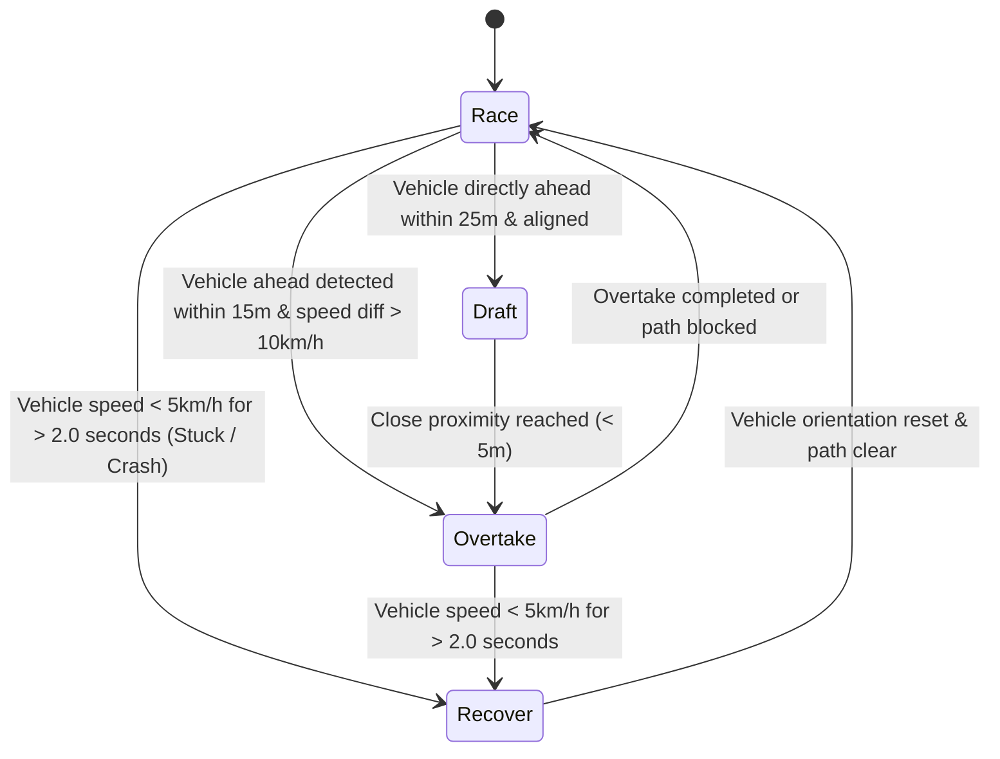

# 🤖 NITRO RUSH — Autonomous Racing AI & Pathfinding Engine

This document details the artificial intelligence system, waypoint graph structure, A* pathfinding algorithm, decision state machine, difficulty tuning curves, and recovery logic in **NITRO RUSH**.

---

## 🛤️ 1. Waypoint Graph Structure

Racing AI requires strict control over speed, corner entry/apex/exit lines, braking points, and overtaking corridors. Rather than relying on generic Unity NavMesh agents, NITRO RUSH uses a custom **Waypoint Directed Graph (`WaypointGraph`)**:

* **`WaypointNode` Attributes**:
  * `Position` (`Vector3`): 3D world space coordinate.
  * `TargetSpeed` (`float`): Recommended velocity in km/h at this waypoint segment (e.g. slowed down before sharp turns).
  * `RacingLineOffset` (`float`): Ideal lateral displacement from track centerline.
  * `Neighbors` (`List<WaypointNode>`): Connected next waypoints (main racing line, alternate overtaking lines, pit lanes).

---

## 🧮 2. A* Pathfinding Algorithm & Cost Heuristic

When an AI vehicle needs to calculate an optimal path around traffic or re-route after a spinout, it executes an $A^*$ pathfinding search over the `WaypointGraph`.

### Cost Function Equation
For a node $n$:
$$f(n) = g(n) + h(n)$$

Where:
* **$g(n)$ Path Cost**:
  $$g(n) = g(\text{parent}) + \text{Distance}(parent, n) + w_{\text{traffic}} \cdot \text{TrafficPenalty}(n) + w_{\text{surface}} \cdot \text{OffRoadPenalty}(n)$$
* **$h(n)$ Euclidean Heuristic**:
  $$h(n) = \sqrt{(x_{\text{target}} - x_n)^2 + (y_{\text{target}} - y_n)^2 + (z_{\text{target}} - z_n)^2}$$

### A* Pathfinding Pseudocode
```python
def find_optimal_racing_path(start_node, target_node):
    open_set = MinHeapPriorityQueue()
    open_set.insert(start_node, priority=0)
    
    g_score = {node: INFINITY for node in graph.nodes}
    g_score[start_node] = 0
    
    came_from = {}
    
    while not open_set.is_empty():
        current = open_set.pop_min()
        
        if current == target_node:
            return reconstruct_path(came_from, current)
            
        for neighbor in current.get_neighbors():
            traffic_penalty = calculate_traffic_density(neighbor)
            offroad_penalty = 10.0 if neighbor.is_offroad else 0.0
            
            tentative_g = (g_score[current] + 
                           distance(current, neighbor) + 
                           traffic_penalty * 1.5 + 
                           offroad_penalty)
            
            if tentative_g < g_score[neighbor]:
                came_from[neighbor] = current
                g_score[neighbor] = tentative_g
                f_score = tentative_g + euclidean_distance(neighbor, target_node)
                
                if open_set.contains(neighbor):
                    open_set.update_priority(neighbor, f_score)
                else:
                    open_set.insert(neighbor, f_score)
                    
    return default_centerline_path()
```

### Min-Heap Complexity Analysis
* **Priority Queue Storage**: Binary Min-Heap (`PriorityQueue<T>`).
* **Time Complexity**:
  * Insertion and Decrease-Key operations take $O(\log V)$ time.
  * For $V$ waypoints and $E$ connecting directed edges, total pathfinding search complexity is $O((V + E) \log V)$.
* **Space Complexity**: $O(V)$ memory storage for `g_score` hash maps and heap structures.

---

## 🔄 3. Decision State Machine & Recovery Logic

AI vehicles switch operational modes via a finite state machine (`DecisionMaker`):



### Recovery Logic (`RecoverySystem`)
When an AI vehicle collides or gets pinned against a wall, `RecoverySystem` activates:
1. **Stuck Detection**: Triggers if vehicle forward speed is below $5\text{ km/h}$ while throttle input is applied for over $2.0\text{ seconds}$.
2. **Reverse Sequence**: Applies negative throttle (reverse) and steering towards open track space for $1.5\text{ seconds}$.
3. **Graph Re-Alignment**: Re-queries `AStarPathfinder` to locate the nearest valid `WaypointNode` and recalculates steering angles.

---

## 🎯 4. AI Difficulty Tuning Matrix

| Parameter / Skill Level | Rookie (Easy) | Pro (Medium) | Legend (Hard) |
| :--- | :--- | :--- | :--- |
| **Max Speed Multiplier** | $85\%$ of top speed | $96\%$ of top speed | $100\%$ of top speed |
| **Braking Accuracy** | Brakes $15\text{m}$ early | Brakes $5\text{m}$ early | Optimal late braking |
| **Reaction Latency** | $300\text{ ms}$ delay | $150\text{ ms}$ delay | $0\text{ ms}$ (instant response) |
| **Nitro Aggression** | Uses Nitro randomly | Uses on straights only | Strategic exit acceleration |

---

## 💡 5. Why NavMesh Was NOT Used (Engineering Rationale)

* **Racing Line Control**: Unity's standard `NavMeshAgent` calculates paths based on surface mesh polygon walking boundaries. It does not understand momentum, apex drift angles, or high-speed racing lines.
* **Physics Integration**: `NavMeshAgent` controls position directly via transform translation or nav-mesh velocity, bypassing wheel friction physics and realistic vehicle suspension forces.
* **Waypoint Advantage**: Explicit `WaypointGraph` Nodes provide precise target velocity values ($v_{\text{target}}$) and apex target points required for realistic arcade car handling.
