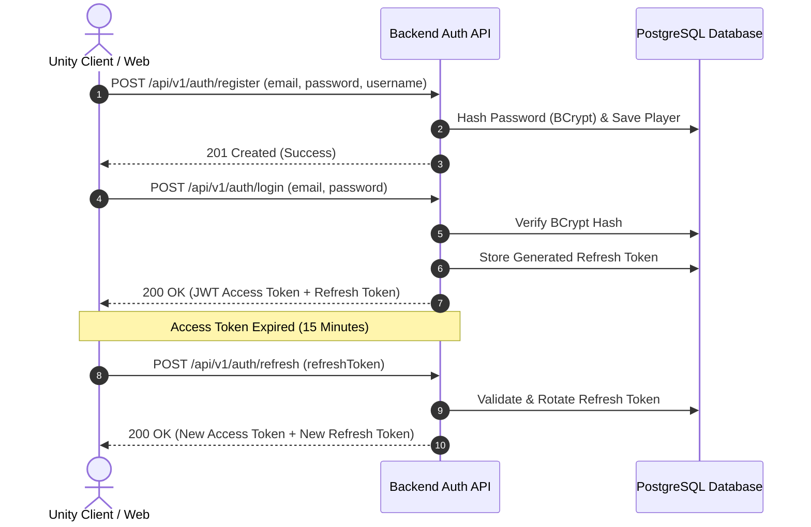

# 🔌 NITRO RUSH — REST & WebSocket API Specification

This document provides the authoritative API reference for the **NITRO RUSH** platform.

---

## 📦 1. Standard Response Envelope

All REST API endpoints wrap response payloads in a consistent `ApiResponse<T>` JSON envelope format:

```json
{
  "success": true,
  "data": { ... },
  "error": null,
  "timestamp": "2026-10-04T16:44:00Z"
}
```

In the event of an error, `success` is set to `false`, `data` is `null`, and `error` provides details:

```json
{
  "success": false,
  "data": null,
  "error": {
    "code": "INSUFFICIENT_FUNDS",
    "message": "Player does not have enough Soft Credits to purchase this car.",
    "details": {
      "required": 15000,
      "current": 10000
    }
  },
  "timestamp": "2026-10-04T16:44:00Z"
}
```

---

## 🔒 2. Authentication Flow

Authentication is managed via stateless JWT access tokens accompanied by HTTP-only refresh tokens.



---

## 🌐 3. REST API Endpoints

### 🔐 Auth Endpoints

#### `POST /api/v1/auth/register`
* **Auth Required**: No
* **Request Body**:
```json
{
  "email": "racer@nitrorush.game",
  "username": "SpeedDemon99",
  "password": "SecurePassword123!"
}
```
* **Response `201 Created`**:
```json
{
  "success": true,
  "data": {
    "userId": "usr_9b1deb4d-3b7d-4bad-9bdd-2b0d7b3dcb6d",
    "username": "SpeedDemon99",
    "email": "racer@nitrorush.game",
    "createdAt": "2026-10-04T16:44:00Z"
  },
  "error": null,
  "timestamp": "2026-10-04T16:44:00Z"
}
```

#### `POST /api/v1/auth/login`
* **Auth Required**: No
* **Request Body**:
```json
{
  "email": "racer@nitrorush.game",
  "password": "SecurePassword123!"
}
```
* **Response `200 OK`**:
```json
{
  "success": true,
  "data": {
    "accessToken": "eyJhbGciOiJIUzI1NiIsInR5cCI6IkpXVCJ9...",
    "refreshToken": "ref_8f9a2b1c-4d3e-2f1a-0b9c-8d7e6f5a4b3c",
    "expiresIn": 900,
    "user": {
      "userId": "usr_9b1deb4d-3b7d-4bad-9bdd-2b0d7b3dcb6d",
      "username": "SpeedDemon99"
    }
  },
  "error": null,
  "timestamp": "2026-10-04T16:44:00Z"
}
```

#### `POST /api/v1/auth/refresh`
* **Auth Required**: No
* **Request Body**:
```json
{
  "refreshToken": "ref_8f9a2b1c-4d3e-2f1a-0b9c-8d7e6f5a4b3c"
}
```
* **Response `200 OK`**:
```json
{
  "success": true,
  "data": {
    "accessToken": "eyJhbGciOiJIUzI1NiIsInR5cCI6IkpXVCJ9.NEW_TOKEN...",
    "refreshToken": "ref_NEW_ROTATED_TOKEN_12345",
    "expiresIn": 900
  },
  "error": null,
  "timestamp": "2026-10-04T16:44:00Z"
}
```

---

### 👤 Player & Garage Endpoints

#### `GET /api/v1/player/profile`
* **Auth Required**: Yes (`Bearer <JWT>`)
* **Response `200 OK`**:
```json
{
  "success": true,
  "data": {
    "userId": "usr_9b1deb4d-3b7d-4bad-9bdd-2b0d7b3dcb6d",
    "username": "SpeedDemon99",
    "level": 12,
    "experience": 14500,
    "softCurrency": 25400,
    "hardCurrency": 120,
    "selectedCarId": "car_apex_racer_v1"
  },
  "error": null,
  "timestamp": "2026-10-04T16:44:00Z"
}
```

#### `GET /api/v1/garage/cars`
* **Auth Required**: Yes (`Bearer <JWT>`)
* **Response `200 OK`**:
```json
{
  "success": true,
  "data": [
    {
      "carId": "car_apex_racer_v1",
      "name": "Apex Racer GT",
      "owned": true,
      "topSpeed": 240.5,
      "acceleration": 3.8,
      "handling": 8.5,
      "installedUpgrades": {
        "engine": 2,
        "turbo": 1,
        "tires": 3
      }
    }
  ],
  "error": null,
  "timestamp": "2026-10-04T16:44:00Z"
}
```

---

### 🏆 Leaderboards & Live Events

#### `GET /api/v1/racing/leaderboards?trackId=track_neon_city&limit=10`
* **Auth Required**: Yes
* **Response `200 OK`**:
```json
{
  "success": true,
  "data": {
    "trackId": "track_neon_city",
    "rankings": [
      {
        "rank": 1,
        "username": "NitroKing",
        "bestLapTimeSeconds": 54.210,
        "carId": "car_apex_racer_v1",
        "timestamp": "2026-10-04T12:00:00Z"
      }
    ]
  },
  "error": null,
  "timestamp": "2026-10-04T16:44:00Z"
}
```

---

## ⚡ 4. WebSocket Real-Time Race Netcode (`/ws/race`)

Real-time multiplayer race synchronization runs over WebSockets at a server tick rate of 20Hz (50ms interval).

### Message Types & Schemas

#### 1. Join Race Request (`JOIN_RACE`) — Client to Server
```json
{
  "type": "JOIN_RACE",
  "payload": {
    "matchId": "match_77a1b2c3",
    "authToken": "eyJhbGciOiJIUzI1Ni...",
    "carId": "car_apex_racer_v1"
  }
}
```

#### 2. Client Input Snapshot (`CLIENT_INPUT`) — Client to Server (20Hz)
```json
{
  "type": "CLIENT_INPUT",
  "payload": {
    "matchId": "match_77a1b2c3",
    "sequenceNumber": 1402,
    "steering": 0.45,
    "throttle": 1.0,
    "brake": 0.0,
    "nitroActive": true,
    "position": { "x": 124.5, "y": 2.1, "z": -88.4 },
    "rotation": { "x": 0.0, "y": 0.707, "z": 0.0, "w": 0.707 },
    "velocity": { "x": 15.2, "y": 0.0, "z": 22.1 },
    "timestampMs": 1728056640100
  }
}
```

#### 3. Server State Broadcast (`SERVER_STATE`) — Server to Client (20Hz)
```json
{
  "type": "SERVER_STATE",
  "payload": {
    "matchId": "match_77a1b2c3",
    "serverTick": 2840,
    "players": [
      {
        "userId": "usr_9b1deb4d",
        "lastProcessedSequence": 1402,
        "position": { "x": 124.48, "y": 2.1, "z": -88.39 },
        "rotation": { "x": 0.0, "y": 0.707, "z": 0.0, "w": 0.707 },
        "velocity": { "x": 15.1, "y": 0.0, "z": 22.0 },
        "currentLap": 2,
        "currentCheckpoint": 5
      }
    ]
  }
}
```

---

## 🚨 5. Error Code Reference

| Error Code | HTTP Status | Description |
| :--- | :--- | :--- |
| `INVALID_CREDENTIALS` | 401 Unauthorized | Email or password incorrect. |
| `EXPIRED_TOKEN` | 401 Unauthorized | JWT access token or refresh token has expired. |
| `INSUFFICIENT_FUNDS` | 400 Bad Request | Player balance insufficient for transaction. |
| `CAR_NOT_UNLOCKED` | 403 Forbidden | Car selected for upgrade/race is not owned by user. |
| `INVALID_RACE_TELEMETRY` | 422 Unprocessable | Submitted race lap time violated physics caps or check order. |
| `RATE_LIMIT_EXCEEDED` | 429 Too Many Requests | HTTP / WS request rate limit bucket depleted. |
