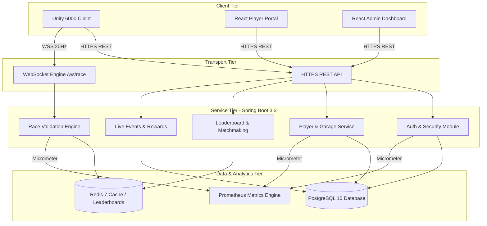
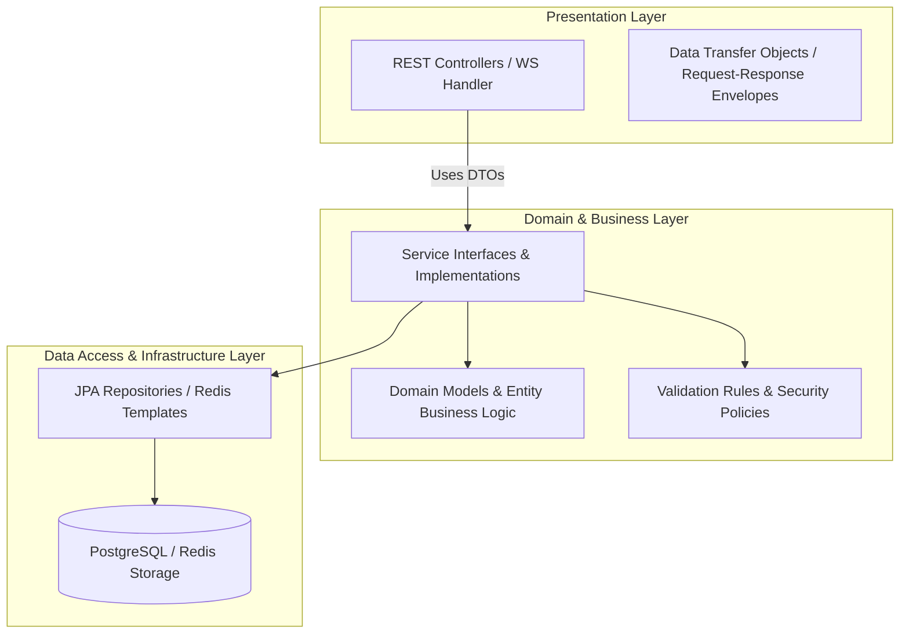
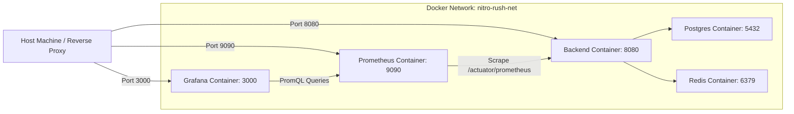

# 📐 NITRO RUSH — System Architecture & Design Patterns

This document describes the high-level software architecture, layered subsystem design, deployment topologies, and design patterns utilized across the **NITRO RUSH** platform.

---

## 🏛️ 1. High-Level System Architecture

NITRO RUSH employs a decoupled client-server architecture. The Unity client handles real-time rendering, local input, and audio-visual effects while relying on a Spring Boot backend for authentication, player progression, economy management, and server-authoritative multiplayer state validation.

---

## 🧱 2. Backend Layered Architecture

The backend is built following Clean Architecture principles and Spring Boot's classic Controller-Service-Repository pattern. Strict layer boundaries ensure separation of concerns, testability, and maintainability.

### Clean Architecture Principles & Layer Rationale
1. **Dependency Injection (DI)**: Components depend on abstractions (interfaces) rather than concrete implementations, enabling effortless unit testing via mock objects (e.g. Mockito).
2. **DTO Segregation**: Database entities are never exposed directly to external clients over REST/WebSocket endpoints. DTOs prevent sensitive field leaks (e.g. password hashes, internal database IDs) and decouple internal database refactoring from public API contracts.
3. **Layer Isolation**: Controllers are strictly responsible for HTTP status mapping, request validation, and routing. Services encapsulate pure business logic and transaction demarcation (`@Transactional`). Repositories handle query execution and persistent object mappings.

---

## 🐳 3. Containerized Deployment Architecture

The entire stack is containerized using Docker, orchestrating 5 core micro-services via Docker Compose:

---

## 🛠️ 4. Catalog of Software Design Patterns

The codebase intentionally applies fundamental design patterns to address explicit architectural challenges in game development and high-throughput backend services:

| Pattern Name | Tier / Location | Architectural Justification & Purpose |
| :--- | :--- | :--- |
| **Object Pool** | Unity Client | Eliminates garbage collection spikes during high-frequency particle, audio, and vehicle wheel effect instantiation. |
| **State Pattern** | Unity Client & Backend | Controls AI vehicle state transitions (Patrol, Race, Overtake, Draft, Recover) and race session state (Lobby, Countdown, Racing, Finished). |
| **Observer Pattern** | Unity Client | Decouples vehicle physics events (speed updates, collision, lap completion) from UI HUD components and telemetry loggers. |
| **Strategy Pattern** | Backend & Unity AI | Swaps driving path calculation heuristics (A* pathfinding cost weighting vs. direct visual raycast steering) dynamically based on AI difficulty. |
| **Factory Pattern** | Backend & Unity Client | Centralizes instantiation of complex vehicle upgrade models and dynamic WebSocket network payload serialization. |
| **Repository Pattern** | Backend | Abstracts raw PostgreSQL JPA queries and Redis sorted-set commands behind strongly-typed Java interfaces. |
| **Dependency Injection** | Backend & Unity Client | Injects dependencies (e.g., Spring `@Autowired`, VContainer in Unity) to achieve loose coupling and high test coverage. |
| **Command Pattern** | Unity Client & Netcode | Encapsulates user drive inputs (steering, throttle, brake, nitro) into timestamped command structs for server transmission and client prediction reconciliation. |
