# 🗄️ NITRO RUSH — Database Schema & Data Engine

This document details the PostgreSQL 16 database architecture, entity-relationship mappings, indexing strategies, primary key design, and transactional concurrency rules for the **NITRO RUSH** platform.

---

## 📐 1. Entity-Relationship (ER) Diagram

```mermaid
erDiagram
    users ||--o| player_profiles : owns
    users ||--o{ refresh_tokens : maintains
    users ||--o{ player_cars : unlocks
    users ||--o{ inventory_items : possesses
    users ||--o{ race_results : submits
    users ||--o{ event_progress : participates
    users ||--o{ reward_claims : claims
    users ||--o{ analytics_events : emits

    cars ||--o{ player_cars : instance_of
    cars ||--o{ car_upgrades : supports
    
    races ||--o{ race_results : yields
    events ||--o{ event_progress : tracks
    events ||--o{ reward_claims : grants

    users {
        uuid id PK
        string email UK
        string password_hash
        string username UK
        timestamp created_at
    }

    player_profiles {
        uuid id PK
        uuid user_id FK,UK
        integer level
        bigint experience
        bigint soft_currency
        bigint hard_currency
        string selected_car_id
        timestamp updated_at
    }

    cars {
        string id PK
        string name
        float base_top_speed
        float base_acceleration
        float base_handling
        bigint unlock_cost_soft
    }

    player_cars {
        uuid id PK
        uuid user_id FK
        string car_id FK
        timestamp acquired_at
    }

    car_upgrades {
        uuid id PK
        string car_id FK
        string category
        integer level
        bigint cost_soft
    }

    inventory_items {
        uuid id PK
        uuid user_id FK
        string item_type
        integer quantity
    }

    races {
        uuid id PK
        string track_id
        string race_mode
        timestamp start_time
    }

    race_results {
        uuid id PK
        uuid race_id FK
        uuid user_id FK
        float lap_time_seconds
        integer final_position
        boolean verified
        timestamp created_at
    }

    events {
        string id PK
        string title
        timestamp start_time
        timestamp end_time
    }

    event_progress {
        uuid id PK
        string event_id FK
        uuid user_id FK
        integer score
    }

    reward_claims {
        uuid id PK
        string idempotency_key UK
        uuid user_id FK
        string reward_type
        bigint amount
        timestamp claimed_at
    }

    analytics_events {
        uuid id PK
        uuid user_id FK
        string event_type
        jsonb metadata
        timestamp created_at
    }

    refresh_tokens {
        uuid id PK
        uuid user_id FK
        string token_hash UK
        boolean revoked
        timestamp expires_at
    }
```



---

## 📋 2. Column Specifications & Data Dictionary

### Table: `users`
* **Purpose**: Core player identity and credentials.
* **Columns**:
  * `id` (`UUID`, PK, Default: `gen_random_uuid()`): Unique user ID.
  * `email` (`VARCHAR(255)`, UNIQUE, NOT NULL): Lowercase email address.
  * `password_hash` (`VARCHAR(255)`, NOT NULL): BCrypt hashed password (cost factor 12).
  * `username` (`VARCHAR(50)`, UNIQUE, NOT NULL): Public player handle.
  * `created_at` (`TIMESTAMPTZ`, NOT NULL): Registration timestamp.

### Table: `player_profiles`
* **Purpose**: Virtual economy wallet and character progression state.
* **Columns**:
  * `id` (`UUID`, PK)
  * `user_id` (`UUID`, FK -> `users.id`, UNIQUE, NOT NULL)
  * `level` (`INT`, Default: `1`): Player experience level.
  * `experience` (`BIGINT`, Default: `0`): Cumulative experience points.
  * `soft_currency` (`BIGINT`, Default: `10000`): Soft currency (Credits).
  * `hard_currency` (`BIGINT`, Default: `50`): Premium currency (Gems).
  * `selected_car_id` (`VARCHAR(50)`, NOT NULL): Active car equipped in garage.

### Table: `reward_claims`
* **Purpose**: Tracks claimed event and quest rewards safely.
* **Columns**:
  * `id` (`UUID`, PK)
  * `idempotency_key` (`VARCHAR(128)`, UNIQUE, NOT NULL): Key generated by client/server to prevent double claiming.
  * `user_id` (`UUID`, FK -> `users.id`, NOT NULL)
  * `reward_type` (`VARCHAR(50)`, NOT NULL)
  * `amount` (`BIGINT`, NOT NULL)
  * `claimed_at` (`TIMESTAMPTZ`, NOT NULL)

---

## 🔑 3. Primary Key Strategy: Why UUID v4?

NITRO RUSH utilizes **UUID v4 (Universally Unique Identifiers)** for all primary keys across volatile runtime tables:

1. **Distributed ID Generation**: Microservices and WebSocket servers can assign valid IDs before persisting records to PostgreSQL without central sequence locking contention.
2. **Security & Obfuscation**: Prevents sequential enumeration attacks where malicious clients attempt to scrape user profiles (`/api/v1/player/1`, `/2`, `/3`).
3. **Multi-Region Sharding**: UUIDs eliminate primary key collision risks when scaling to multi-region database topologies.

---

## 🔒 4. Virtual Economy Concurrency & Idempotency Rules

### Atomic Currency Deduction via Pessimistic Locks
To prevent race conditions during garage purchases, item upgrades, or loot box redemption, balance updates execute within Spring `@Transactional` blocks backed by PostgreSQL pessimistic write locks (`SELECT ... FOR UPDATE`):

```sql
-- Atomic Soft Currency Deduction Query
SELECT * FROM player_profiles WHERE user_id = :userId FOR UPDATE;

UPDATE player_profiles 
SET soft_currency = soft_currency - :itemCost,
    updated_at = NOW()
WHERE user_id = :userId AND soft_currency >= :itemCost;
```

### Idempotent Reward Claims
Every reward claim requires an `idempotency_key`. The `reward_claims` table enforces a `UNIQUE` constraint on `idempotency_key`. If a network retry or duplicate request occurs, PostgreSQL rejects the duplicate insert with a unique key violation, ensuring players cannot double-claim rewards.
