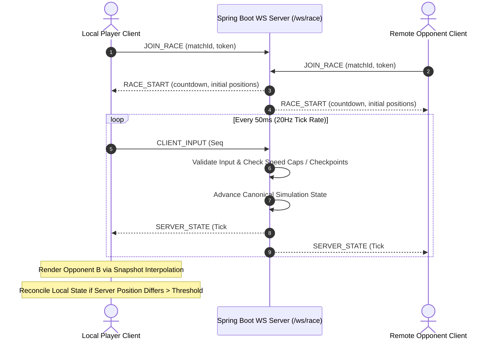

# 🌐 NITRO RUSH — Server-Authoritative Netcode & Multiplayer Architecture

This document details the multiplayer architecture, real-time WebSocket protocol (`/ws/race`), interpolation mathematics, client prediction, reconciliation routines, and anti-cheat validation rules in **NITRO RUSH**.

---

## 🛰️ 1. Server-Authoritative Netcode Sequence

NITRO RUSH utilizes a **server-authoritative model** operating over WebSockets at a tick rate of 20Hz (50ms snapshot interval). The server validates inputs, simulates vehicle kinematics, enforces anti-cheat speed/position constraints, and broadcasts canonical state updates to all race participants.

---

## 🧮 2. Snapshot Interpolation Mathematics

To prevent visual jitter caused by network latency variation (jitter), remote vehicle positions are rendered using **Snapshot Interpolation** with a rendering buffer delay ($T_{buffer} = 100\text{ ms}$, equal to 2 server ticks).

### Rendering Time Calculation
$$T_{render} = T_{current} - T_{buffer}$$

Where $T_{current}$ is the client local clock and $T_{buffer} = 100\text{ ms}$.

### Hermite Position Interpolation Formula
For smooth velocity-aware positional smoothing between snapshots $S_0$ and $S_1$ at normalized time $t \in [0, 1]$:

$$P(t) = (2t^3 - 3t^2 + 1) P_0 + (t^3 - 2t^2 + t) V_0 \Delta t + (-2t^3 + 3t^2) P_1 + (t^3 - t^2) V_1 \Delta t$$

Where:
* $P_0, P_1$ are vehicle positions at $S_0$ and $S_1$.
* $V_0, V_1$ are vehicle velocity vectors at $S_0$ and $S_1$.
* $\Delta t = T_{S_1} - T_{S_0} = 50\text{ ms}$.

### Quaternion Rotation Slerp
Rotations are interpolated using Spherical Linear Interpolation (Slerp):
$$Q(t) = \text{Slerp}(Q_0, Q_1, t) = \frac{\sin((1-t)\theta)}{\sin \theta} Q_0 + \frac{\sin(t\theta)}{\sin \theta} Q_1$$

Where $\cos \theta = Q_0 \cdot Q_1$.

---

## 🔄 3. Client Prediction & Server Reconciliation

To achieve responsive local driving controls without feeling network lag, the local player client runs **Client Prediction**:

1. **Local Input Application**: User steering and acceleration inputs immediately apply to the local physics vehicle.
2. **Input History Queue**: Applied inputs are saved in a circular buffer along with sequence numbers and timestamps (`InputHistory`).
3. **Server State Arrival**: When `SERVER_STATE` arrives from the backend containing last processed sequence $S_{server}$ and canonical position $P_{server}$:
   - Compare local predicted position $P_{predicted}$ at $S_{server}$ with $P_{server}$.
   - If $|P_{predicted} - P_{server}| > 0.35\text{ meters}$ (error threshold):
     - **Reconciliation**: Snap local position to $P_{server}$.
     - **Re-simulation**: Re-apply all unacknowledged inputs in $InputHistory$ from $S_{server} + 1$ to current sequence $S_{current}$.

---

## 🛡️ 4. Anti-Cheat Physics & Telemetry Rules

The backend server strictly validates telemetry snapshots to defeat speed hacks, teleportation, and checkpoint clipping:

| Validation Rule | Threshold Limit | Action on Failure |
| :--- | :--- | :--- |
| **Max Speed Cap** | $320\text{ km/h}$ ($88.8\text{ m/s}$) for Tier 3 cars | Reject input update; snap position back. |
| **Max Acceleration Delta** | $\Delta V > 25\text{ m/s}^2$ without Nitro | Flag telemetry; mark race unverified. |
| **Par-Time Lap Floor** | Lap time < Track minimum (e.g. 40.0s for Track 1) | Disqualify lap time submission. |
| **Sequential Checkpoints** | Checkpoint index must increase monotonically | Reject lap completion attempt. |

---

## 📈 5. Scaling Architecture Notes

* **MVP Configuration**: Supports 4 to 8 players per active match room managed by Spring Boot WebSocket session handlers.
* **Roadmap Scaling (Phase 2)**:
  * Migration from single-node WebSocket handling to dedicated room servers orchestrated by Kubernetes / Agones.
  * Interest management (spatial grid partitioning) to reduce network payload sizes when expanding to 16+ player lobby races.
