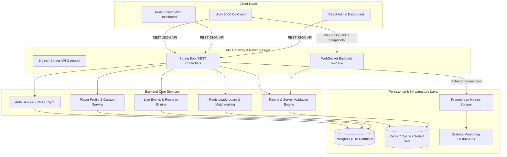

```
██╗  ██╗██╗████████╗██████╗  ██████╗     ██████╗ ██╗   ██╗███████╗██╗  ██╗
████╗██║██║╚══██╔══╝██╔══██╗██╔═══██╗    ██╔══██╗██║   ██║██╔════╝██║  ██║
██╔██╗██║██║   ██║   ██████╔╝██║   ██║    ██████╔╝██║   ██║███████╗███████║
██║╚████║██║   ██║   ██╔══██╗██║   ██║    ██╔══██╗██║   ██║╚════██║██╔══██║
██║ ╚███║██║   ██║   ██║  ██║╚██████╔╝    ██║  ██║╚██████╔╝███████║██║  ██║
╚═╝  ╚══╝╚═╝   ╚═╝   ╚═╝  ╚═╝ ╚═════╝     ╚═╝  ╚═╝ ╚═════╝ ╚══════╝╚═╝  ╚═╝
```

# 🏎️ NITRO RUSH — High-Octane Live-Service Racing Engine

[](https://github.com/nitrorush/nitro-rush/actions/workflows/ci.yml)
[](https://github.com/nitrorush/nitro-rush/actions/workflows/web-ci.yml)
[](https://github.com/nitrorush/nitro-rush/actions/workflows/unity-ci.yml)
[](LICENSE)

> **This is NOT just a Unity game.**  
> **NITRO RUSH** is a full-stack, enterprise-grade, live-service multiplayer racing platform. It integrates custom Arcade vehicle dynamics, graph-based A* autonomous AI, server-authoritative WebSocket netcode, Redis sorted-set leaderboards, a transactional JPA/PostgreSQL virtual economy, real-time Prometheus observability, and React TypeScript admin control planes.

---

## 🚀 Key Feature Grid

| Subsystem | Architectural Highlights |
| :--- | :--- |
| **🎮 Game Engineering** | Custom 4-wheel arcade vehicle physics, suspension raycasting, slip ratio tire friction, zero-allocation object pooling. |
| **🤖 Autonomous AI** | Waypoint-graph A* pathfinding with custom cost functions ($g = \text{distance} + \text{traffic} + \text{offroad}$, $h = \text{euclidean}$), $O((V+E)\log V)$ min-heap priority queue, dynamic overtaking, stuck recovery logic. |
| **⚡ Backend Architecture** | Spring Boot 3.3, Java 21, Spring Security with stateless JWT + refresh token rotation, pessimistic locking for atomic currency transactions. |
| **🌐 Multiplayer Netcode** | Server-authoritative 20Hz WebSocket engine (`/ws/race`), snapshot interpolation, client prediction with server reconciliation, anti-cheat physics validation. |
| **📈 Live Services & Economy** | Redis sorted-set global & event leaderboards, dynamic live events engine, reward claims with idempotency keys, Prometheus metrics + Grafana monitoring. |
| **💻 Web & Admin Apps** | React 18, TypeScript, Tailwind CSS player web portal and real-time operational dashboard for game operators. |
| **🐳 Infrastructure & DevOps** | Multi-stage Dockerized deployment, Docker Compose stack, healthcheck probes, and complete GitHub Actions CI/CD pipelines. |

---

## 🏗️ High-Level Architecture Diagram



---

## 🧰 Tech Stack Reference

| Component | Technology / Library | Version / Tooling |
| :--- | :--- | :--- |
| **Client Engine** | Unity Engine (C# .NET 8) | Unity 6000.0.x / Universal Render Pipeline |
| **Client UI & Asset Mgt** | Unity UI Toolkit / Addressables | Addressables 1.21+ |
| **Backend Framework** | Spring Boot / Java | Spring Boot 3.3.x, Java 21 LTS |
| **Security & Auth** | Spring Security, JJWT | BCrypt (cost factor 12), Refresh Token Rotation |
| **Primary Database** | PostgreSQL | PostgreSQL 16 Alpine, Spring Data JPA / Hibernate |
| **In-Memory Cache / Leaderboards** | Redis | Redis 7 Alpine, Spring Data Redis |
| **Dashboards** | React, TypeScript, Tailwind CSS | React 18, TS 5, Vite, Lucide Icons |
| **Metrics & Observability** | Prometheus, Grafana | Micrometer Prometheus Registry, Grafana 10+ |
| **Containerization** | Docker, Docker Compose | Multi-stage Alpine builds |
| **CI/CD Automation** | GitHub Actions | Workflows for Java, Node.js, and C# Static Analysis |

---

## 📂 Repository Layout Tree

```
nitro-rush/
├── .github/
│   ├── scripts/
│   │   └── check_cs_syntax.py        # Lightweight C# syntax validator
│   └── workflows/
│       ├── ci.yml                    # Backend Maven test & Docker build workflow
│       ├── web-ci.yml                # Dashboards React build matrix workflow
│       └── unity-ci.yml              # Unity client static analysis workflow
├── admin-dashboard/                  # React TS Tailwind Admin Management Dashboard
├── backend/                          # Spring Boot 3.3 Java 21 REST & WebSocket backend
│   ├── pom.xml
│   └── src/
├── infrastructure/                   # Infrastructure configuration & Docker stack
│   ├── .env.example
│   ├── backend.Dockerfile            # Multi-stage Java 21 JRE container build
│   ├── docker-compose.yml            # Multi-container local production-like stack
│   ├── deploy-notes.md               # Infrastructure setup & execution guide
│   ├── grafana/                      # Provisioned Grafana datasources and dashboards
│   └── prometheus/                   # Prometheus scrape configuration
├── unity-client/                     # Unity 6000 arcade racing client project
│   └── Assets/
│       ├── Scripts/                  # Physics, AI, Networking, UI C# source code
│       ├── Prefabs/
│       └── Scenes/
├── web-dashboard/                    # React TS Player Web Portal
├── AI.md                             # Waypoint graph A* pathfinding & decision docs
├── API.md                            # Comprehensive REST & WebSocket API specification
├── ARCHITECTURE.md                   # System design, layered architecture & design patterns
├── CONTRIBUTING.md                   # Branching, commits, styling & PR guidelines
├── DATABASE.md                       # PostgreSQL ER diagram, schemas & transaction rules
├── DEVELOPMENT_STATUS.md             # Real-time implementation status & gap tracking
├── MULTIPLAYER.md                    # Netcode, client prediction & interpolation specs
├── PERFORMANCE.md                    # Optimization techniques & benchmark methodology
├── SECURITY.md                       # Auth, rate limiting & server-authoritative defense
└── README.md                         # Project overview and front page
```

---

## ⚡ Quickstart Guide

### 1. Launch Backend Infrastructure (Docker Compose)

To start PostgreSQL, Redis, Spring Boot backend, Prometheus, and Grafana:

```bash
cd infrastructure
cp .env.example .env
docker compose up -d
```

Verify that services are up and running:
- **Backend API**: `http://localhost:8080/actuator/health`
- **Grafana Monitoring**: `http://localhost:3000` (User: `admin`, Password: `adminpassword123`)
- **Prometheus Console**: `http://localhost:9090`

### 2. Launch Unity Client

1. Install **Unity 6000.0.x** (or Unity 2023.3 LTS with C# 12 support).
2. Open the directory `unity-client/` inside Unity Hub.
3. Ensure **Addressables** package is initialized via `Window -> Asset Management -> Addressables -> Groups`.
4. Open scene `Assets/Scenes/Boot/BootScene.unity` and click **Play**.

---

## 📖 Documentation Index

| Documentation File | Subject Matter & Engineering Coverage |
| :--- | :--- |
| 📐 [**ARCHITECTURE.md**](ARCHITECTURE.md) | High-level system design, clean architecture, layer separation, design pattern catalog. |
| 🔌 [**API.md**](API.md) | Complete REST specification, JSON envelope format, error codes, WebSocket `/ws/race` message schemas. |
| 🗄️ [**DATABASE.md**](DATABASE.md) | Mermaid ER diagram, PostgreSQL table schemas, indexes, foreign keys, atomic financial transactions. |
| ⚡ [**PERFORMANCE.md**](PERFORMANCE.md) | Profiling methodology, object pooling stats, non-allocating physics, benchmark result tables. |
| 🌐 [**MULTIPLAYER.md**](MULTIPLAYER.md) | Server-authoritative netcode, snapshot interpolation, client prediction, reconciliation, anti-cheat rules. |
| 🤖 [**AI.md**](AI.md) | Waypoint graph structure, A* cost formula, priority queue complexity, decision state machine, recovery. |
| 🛡️ [**SECURITY.md**](SECURITY.md) | JWT + refresh token rotation, rate limiting, anti-cheat checks, idempotency, security gaps. |
| 🤝 [**CONTRIBUTING.md**](CONTRIBUTING.md) | Conventional commits, git branch workflow, C#/Java code style, unit testing standards. |
| 📊 [**DEVELOPMENT_STATUS.md**](DEVELOPMENT_STATUS.md) | Transparent implementation matrix, verified CI checks, un-authored Unity scene track list. |

---

## 📅 6-Week Project Roadmap

| Phase | Duration | Milestones & Key Deliverables |
| :--- | :--- | :--- |
| **Phase 1: Core Physics & AI** | Weeks 1 – 2 | Raycast arcade physics, tire friction curves, Waypoint graph editor, A* pathfinding. |
| **Phase 2: Backend & Database** | Week 3 | Spring Boot 3.3 setup, PostgreSQL schema migrations, JWT auth, Redis sorted-set leaderboards. |
| **Phase 3: Multiplayer Netcode** | Week 4 | Server-authoritative WebSocket server (`/ws/race`), snapshot interpolation, client prediction. |
| **Phase 4: Polish & Profiling** | Week 5 | Object pooling integration, `NonAlloc` physics refactoring, performance profiling overlay, benchmarking. |
| **Phase 5: Docs & Media** | Week 6 | Production documentation suite, Grafana monitoring provisioning, CI/CD pipeline completion, demo recording. |

---

## ⚖️ License

Distributed under the **MIT License**. See [`LICENSE`](LICENSE) for more information.
